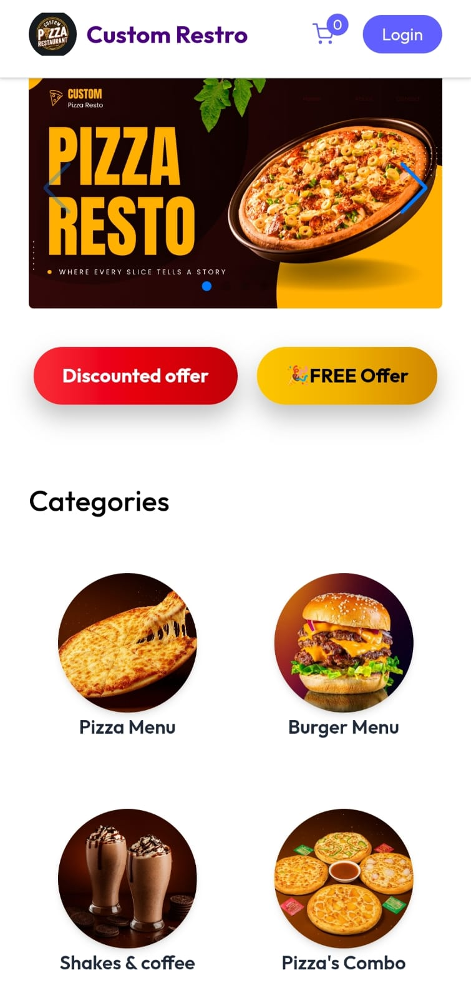
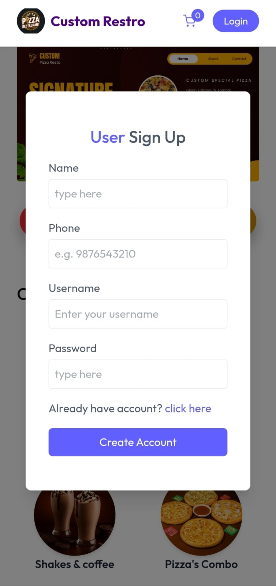
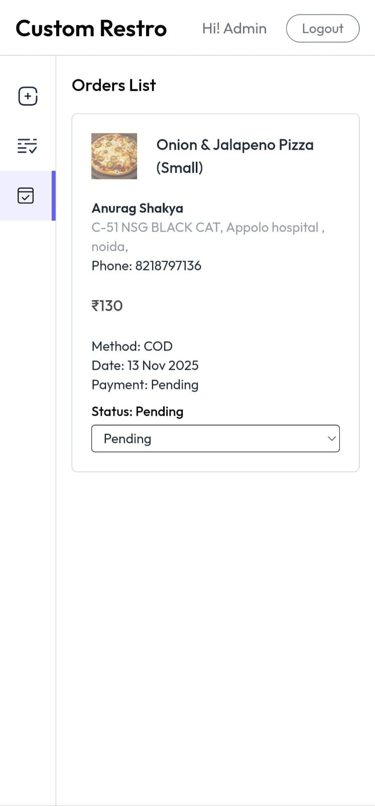

# Full-Stack MERN Restaurant Ordering System (Production Build)

A fully functional, production-grade MERN stack restaurant ordering system built and deployed for a real restaurant.  
This platform processes **40–50 orders per day** through **dine-in, takeaway, online (Stripe payments), and Cash on Delivery (COD)**.

Built with scalable architecture, secure authentication, smart pricing logic, seller dashboard, and fully mobile-responsive UI optimized for real restaurant operations.

---

## 🔗 Live Website (Production)

**Live link:**  
https://restaurent-full-mern-website-6zlr.vercel.app    
 
---

## 📸 Project Screenshots

<!-- Row 1: Home + Login -->
<div style="display: flex; gap: 10px;">
  
   
</div>

<br/>

<!-- Row 2: Cart + Seller Dashboard -->
<div style="display: flex; gap: 10px;">
  
  
</div>


---

# ⭐ Key Features

### 1. Dual Authentication System (User + Seller)
- User login/register  
- Dedicated seller/admin login  
- JWT-based authentication (Bearer Token)  
- Token stored in **LocalStorage** for mobile browser support  
- Fixes cookie blocking & 403 issues  

### 2. Product Variants & Dynamic Pricing
- Pizza sizes → Small / Medium / Large  
- Other products (drinks, rolls) use single pricing  
- Dynamic cart recalculations  

### 3. Delivery Charge Logic (Smart Backend)
- ₹40 delivery charge only if subtotal < ₹250  
- Logic enforced in backend for security  
- Consistent between COD & Stripe  

### 4. Stripe Payment Integration (Live Ready)
- PaymentIntent API  
- Secure backend validation  
- Webhook-based order confirmation  
- Prevents fake orders  

### 5. Seller Dashboard (Admin Panel)
- See all orders  
- Customer phone included  
- Update order status  
- New order sound alert 
- Clean UI  

### 6. UI & UX
- Tailwind CSS  
- Hover background animation  
- Fully responsive  
- Fast performance  

---

# 🧬 Tech Stack

| Category | Technology |
|---------|------------|
| Frontend | React.js (Vite) |
| Styles | Tailwind CSS |
| State | React Context API |
| Backend | Node.js, Express.js |
| Database | MongoDB Atlas |
| Auth | JWT (Bearer Tokens) |
| Images | Cloudinary |
| Payments | Stripe |
| Deployment | Vercel (Frontend), Render/Node Server (Backend) |

---

# 📁 Folder Structure (Actual Project Structure)

## Frontend (`client/`)
```
client/
├── public/
│   ├── favicon.svg
│   ├── Logo.png
│   ├── menu1.jpg
│   └── vite.svg
│
├── src/
│   ├── assets/
│   ├── components/
│   │   ├── seller/
│   │   │   └── SellerLogin.jsx
│   │   ├── Banner.jsx
│   │   ├── BannerCarousel.jsx
│   │   ├── BestSeller.jsx
│   │   ├── Category.jsx
│   │   ├── Footer.jsx
│   │   ├── loading.jsx
│   │   ├── Navbar.jsx
│   │   ├── NewsLetter.jsx
│   │   └── ProductCard.jsx
│   │
│   ├── context/
│   │   └── AppContext.jsx
│   │
│   ├── modals/
│   │   └── Auth.jsx
│   │
│   ├── pages/
│   │   ├── seller/
│   │   ├── Address.jsx
│   │   ├── Cart.jsx
│   │   ├── Deals.jsx
│   │   ├── Home.jsx
│   │   ├── MyOrders.jsx
│   │   ├── Offers.jsx
│   │   └── ProductDetails.jsx
│
└── main.jsx
```

## Backend (`backend/`)
```
backend/
├── config/
│
├── controllers/
│   ├── address.controller.js
│   ├── cart.controller.js
│   ├── order.controller.js
│   ├── product.controller.js
│   ├── seller.controller.js
│   └── user.controller.js
│
├── middlewares/
│   ├── authSeller.js
│   └── authUser.js
│
├── models/
│   ├── address.model.js
│   ├── order.model.js
│   ├── product.model.js
│   └── user.model.js
│
├── routes/
│   ├── address.routes.js
│   ├── cart.routes.js
│   ├── order.routes.js
│   ├── product.routes.js
│   ├── seller.routes.js
│   └── user.routes.js
│
├── uploads/
│
├── index.js
└── package.json
```

---

# ⚙️ Installation & Setup

## 1️⃣ Backend Setup

### Install Dependencies
```bash
cd backend
npm install
```

### Run Backend
```bash
npm start
```
or
```bash
nodemon index.js
```
---

# 🧪 API Endpoints Summary

## Auth
```
POST /auth/register
POST /auth/login
POST /auth/seller/login
```

## Products
```
GET /products
POST /products
PUT /products/:id
DELETE /products/:id
```

## Orders
```
POST /orders/create
GET /orders/user
GET /orders/seller
PUT /orders/status/:id
```

## Payments
```
POST /payments/create-intent
POST /payments/webhook
```

---

# 🎤 Important Concepts (Interview Ready)

### Seller Authentication Logic
- JWT Bearer token  
- `authSeller.js` checks:  
  ```
  decoded.email === process.env.SELLER_EMAIL
  ```
- Prevents unauthorized access  

### Why JWT Instead of Cookies?
- Mobile browsers block cookies  
- LocalStorage token avoids 401 errors  

### Product Schema With Variants
- `sizes[]` array for pizza  
- Dynamic price calculation  

### Stripe Payment Flow
- PaymentIntent  
- Webhook confirmation  
- Prevents fake orders  

### Delivery Charge (Backend Logic)
- Applied only when subtotal < ₹250  
- Backend enforced → secure  

---

# 📊 Real Production Performance

- **40–50 orders per day**  
- Used daily in a real restaurant  
- Supports dine-in, takeaway, delivery  
- Zero downtime on Vercel  
- Fast on all mobile devices  

---

# 📞 Contact

**Developer:** Pravesh Sachan  
**Location:** Gr.noida, India  
**Project:** Full Restaurant MERN Website  
**Live:** https://restaurent-full-mern-website-6zlr.vercel.app  

---

# ✔ End of README
Thank you for checking out this project.

